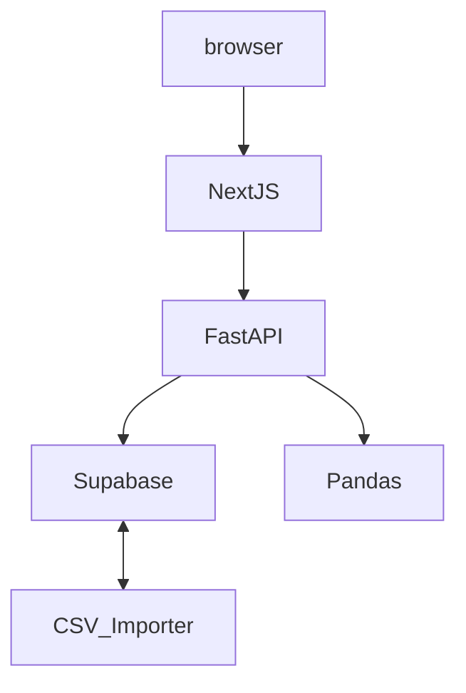

<!--
PLANNING.md
This file describes the full technical plan for the swimming‑analytics web application.
Cursor‑AI: treat headings as sections for contextual retrieval.
-->

# Product Vision

Build a web platform that enables high‑performance swimming coaches and teams to **ingest, analyse, compare, visualise and update** race data.

- Baseline support for **16‑20 performance metrics per race**.
- Quick, interactive insights (MVP) with a pathway to predictive analytics and external API integrations (v2+).

# Target Stack (confirmed)

| Layer      | Technology            | Rationale |
|------------|-----------------------|-----------|
| Frontend   | **React 18 + Next.js 14** | SSR/ISR, file‑system routing, SEO. |
| Styling    | **TailwindCSS 3**     | Utility‑first, responsive design. |
| Charts     | **Plotly.js 2**       | Interactive, research‑grade plots. |
| HTTP Client| **Axios 1**           | Interceptors, promise‑based API calls. |
| Backend    | **FastAPI 0.111**     | Async Python, auto‑generated OpenAPI docs. |
| Schema     | **Pydantic 2.7**      | Data validation, model serialization, strict typing. |
| Analysis   | **Pandas 2**          | Vectorised statistics, CSV import. |
| ORM        | **SQLAlchemy 2 + asyncpg** | PostgreSQL/Supabase compatibility. |
| Database   | **PostgreSQL (Supabase)** | Managed, auth, row‑level security. |
| Hosting    | **Vercel** (frontend) / **Railway** (backend) | Free‑tier friendly, CI/CD ready. |

# High‑level Architecture



- **Separation of concerns**: UI in Vercel, API/analysis in Railway.
- **Stateless API** returning JSON; heavy computations delegated to Pandas within FastAPI services.

# Repository & Workspace Layout

## 📁 Project Structure (Full Layout)

```bash
natacion-app/
│
├── frontend/                 # React + Next.js 14 (Vercel)
│   ├── pages/               # Route-based pages
│   │   ├── index.js
│   │   ├── dashboard.js
│   │   ├── competitions.js
│   │   ├── swimmers.js
│   │   └── data-entry.js
│   ├── components/          # Reusable UI components
│   ├── services/            # Axios API wrappers
│   ├── styles/              # Tailwind / CSS files
│   └── utils/               # Helper functions
│
├── backend/                  # FastAPI (Railway)
│   ├── main.py              # Entry point for FastAPI
│   ├── routers/             # API endpoints by feature
│   │   ├── competitions.py
│   │   ├── swimmers.py
│   │   ├── data_entry.py
│   │   └── csv.py
│   ├── services/            # Business logic
│   │   ├── data_analysis.py
│   │   ├── csv_importer.py
│   │   └── auto_metrics.py
│   ├── models/              # ORM models
│   ├── schemas/             # Pydantic schemas
│   ├── database/            # DB connection & helpers
│   └── dictionaries/        # Metric dictionary (metrics.json)
│
├── .cursor/                 # Cursor agent settings
│   └── rules/
│       └── error-learning.yaml
│
├── requirements.txt         # Backend Python deps
├── package.json             # Frontend JS deps
├── PLANNING.md              # Project architecture and tech stack
├── TASK.md                  # Ordered execution roadmap
└── README.md
```

## Cursor workspace snippet

```jsonc
{
  "folders":[
    {"path":"frontend"},
    {"path":"backend"}
  ],
  "settings":{
    "python.defaultInterpreterPath":"${workspaceFolder:backend}/venv/bin/python"
  }
}
```

# Key Application Modules

## Data Entry & Metric Dictionary

### 1. Data-Entry Module (UI + API)

| Element | Target file | Purpose |
|---------|-------------|---------|
| **Frontend Page** | `pages/data-entry.js` | Auth-protected form for creating/updating race metrics per swimmer and phase (PRELIM / SEMIS / FINAL). |
| **Backend Router** | `routers/data_entry.py` | Endpoints `POST /metrics` and `PUT /metrics/{id}`. Validates payload against the dictionary and triggers auto-metric calculations. |
| **Service** | `services/auto_metrics.py` | Pure functions that compute derived metrics. |

**Flow**

1. User submits manual inputs (age, weight, splits, etc.).  
2. FastAPI validates against the dictionary and calls `auto_metrics.py`.  
3. Completed record is stored, JSON returned, UI refreshes.

### 2. Metric Dictionary

Stored in `dictionaries/metrics.json`: Example

 ```jsonc
[
  {
    "code": "50_SPL",
    "label": "Stroke Rate 50 m",
    "unit": "strokes/min",
    "type": "auto",
    "calc": "calc_stroke_rate"
  },
  {
    "code": "RACE_TIME",
    "label": "Official Race Time",
    "unit": "sec",
    "type": "manual"
  }
]
```
    code: unique internal key.
    label: UI display name.
    unit: abbreviation shown on charts.
    type: manual = user input, auto = backend computed.
    calc: function name inside auto_metrics.py (only for auto).

FastAPI loads this JSON at startup and uses it to
    Validate /metrics payloads.
    Map label + unit on API responses for Plotly.
    Tell the Frontend which fields are manual vs. auto.

Frontend calls /dictionary (new GET) to dynamically render inputs with the correct units.

3. DB Extension (results table)
Column:	PG type	Source
phase:	phase_enum (PRELIM, SEMIS, FINAL)	UI dropdown
metric_json	jsonb:	{code: value} key-value store

## Frontend Pages

| File / Route      | Purpose |
|-------------------|---------|
| `pages/index.js`        | Auth landing page (Supabase). |
| `pages/dashboard.js`    | KPI overview, coach quick glance. |
| `pages/swimmers.js`     | CRUD + profile stats. |
| `pages/competitions.js` | Race‑centric analytics (16‑20 metrics, comparisons, CSV upload). |

## Backend Routers

| Router              | Endpoints (sample) |
|---------------------|--------------------|
| `swimmers.py`       | `GET /swimmers`, `POST /swimmers` |
| `competitions.py`   | `GET /competitions`, `GET /competitions/{id}/results` |
| `csv.py`            | `POST /import` (multipart CSV) |

## Services

- `data_analysis.py` – metric calculations, returns dict ready for Plotly.
- `csv_importer.py` – validates & bulk‑inserts CSV rows.
- `helpers.py` – unit conversions, time formatting utilities.

# Dependency Matrix

```txt
# frontend/package.json (production)
next, react, react-dom, tailwindcss, autoprefixer, postcss, axios, plotly.js

# frontend/dev
eslint, eslint-config-next, prettier

# backend/requirements.txt
fastapi, uvicorn[standard], pandas, sqlalchemy, asyncpg, python-dotenv,
python-multipart, pydantic

# backend/dev
pytest, black
```

# MVP Functional Scope

1. **Auth** – Email/password via Supabase.
2. **CSV import** – Single race file, ~16‑20 columns.
3. **List & drill‑down views** – competitions → heats → swimmer metrics.
4. **Visualisation** – Line & bar charts for selected metrics.
5. **Basic comparison** – Two swimmers or two races, metric‑by‑metric delta.

# Post‑MVP Roadmap (placeholder)

- Predictive models (time improvements, fatigue alerts).
- External sports‑science APIs.
- Custom dashboards / alerting.
- Trainning metrics implementation
- Security improvements 

# CI/CD Notes

- GitHub Actions: lint + test on PR; deploy `main` to Vercel (frontend) & Railway (backend).
- Env‑vars injected by platforms; version `.env.example` maintained.
<!-- End of PLANNING.md -->
